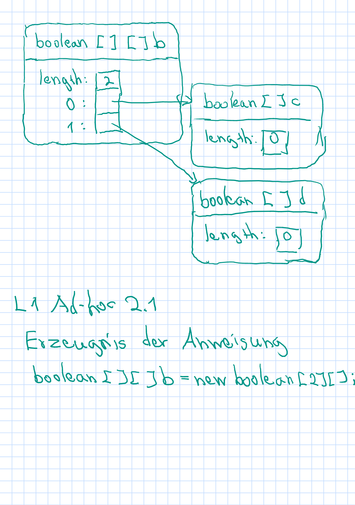

# Ad-hoc-Aufgabe 2

## 1. Wie sieht das Objektgeflecht aus, das durch die Anweisung `boolean [ ] [] b = new boolean [2] [];` erzeugt wird?



Als Instanz von boolean [2] [] hat b die Länge 2 und zwei Dimensionen. Die Elemente von können als Referenzen auf weitere boolean-Arrays speichern. Die Länge der Arrays c und d wurde nicht in b initialisiert, beträgt also den int-Standardwert 0. c und d sind also zunächst leer.

## 2. Überlegen Sie, was passieren wird, wenn anschließend diese Anweisung ausgeführt wird: `b [0] [0] = true;`

**Vermutung**: b[0] [0] verweist auf das erste ELement von c. Momentan hat c aber noch keine Elemente. Deshalb wird die Ausführung der Anweisung eine Fehlermeldung erzeugen.

**Test**:

```
public class Aufgabe2Test {
    public static void main(String[] args) {
        boolean [] [] b = new boolean [2] [];
        b [0] [0] = true;
    }
}

Exception in thread "main" java.lang.NullPointerException: Cannot store to byte/boolean array because "b[0]" is null
        at Aufgabe2Test.main(Aufgabe2Test.java:4)
```

**Fazit**: Vermutung war richtig.

## 3. Seien `value` und `newValue` Variablen vom Typ `int`. Welchen Wert hat `value` nach der folgenden Anweisung?

`value = newValue > value ? new Value : value;`

**Vermutung**: Da die Operatoren > und = den gleichen Rang haben, wird der Teilausdruck `value = newValue > value` von links nach rechts ausgewertet. Der Variable `value`wird also zuerst der Wert von `newValue` zugewiesen. Dann wird geprüft, ob der neue Wert von `value` größer ist als der alte Wert von `value`. Falls ja, wird der neue Wert zurückgegben, falls nicht, der alte.

**Test**:

Bei `newValue > value`:

```
public class Aufgabe2Test {
    public static void main(String[] args) {
        int value = 3;
        int newValue = 5;
        System.out.println(value = newValue > value ? newValue : value);
    }
}
```

Ausgabe: 5

Bei `newValue <= value`:

```
public class Aufgabe2Test {
    public static void main(String[] args) {
        int value = 7;
        int newValue = 3;
        System.out.println(value = newValue > value ? newValue : value);
    }
}
```

Ausgabe: 7

**Fazit**: Vermutung war richtig.
