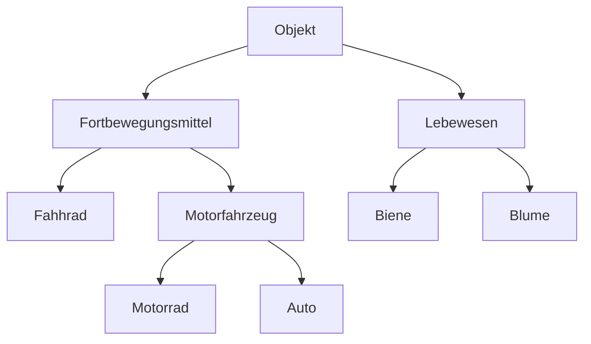
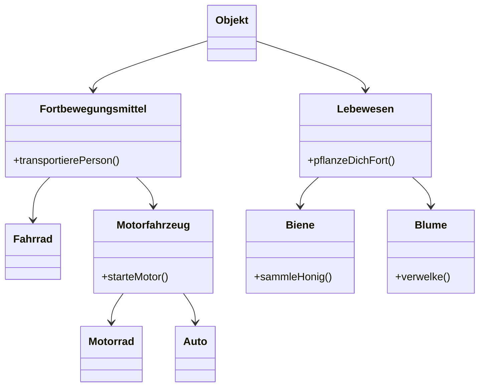
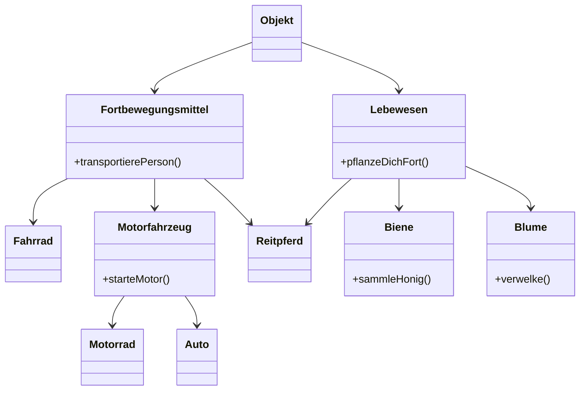

# Ad-hoc-Aufgabe 1

## 1. Überlegen Sie, welche Objekte welche Nachrichten verstehen könnten.

| Objekt              | Versteht Nachrichten             |
|---------------------|----------------------------------|
| Fahrrad             | transportierePerson              |
| Lebewesen           | pflanzeDichFort                  |
| Biene               | pflanzeDichFort, sammleHonig     |
| Motorrad            | transportierePerson, starteMotor |
| Motorfahrzeug       | transportierePerson, starteMotor |
| Objekt              |                                  |
| Blume               | pflanzeDichFort, verwelke        |
| Auto                | transportierePerson, starteMotor |
| Fortbewegungsmittel | transportierePerson              |

## 2. Klassenhierarchie

## 3. Nachrichten der höchstmöglichen Klasse zuordnen

## 4. Abstrakte Klassen

- **Objekt**: In diesem Beispiel wird "Objekt" nur dafür verwendet, um abstrakte Klassen zusammenzufassen und hat selbst keine direkten Objekte.
- **Fortbewegungsmittel**: Kein Fortbewegungsmittel ist nur ein Fortbewegungsmittel, ohne sich weiter spezifizieren zu lassen.
- **Motorfahrzeug**: Analog zu "Fortbewegungsmittel"
- **Lebewesen**: Analog zu "Fortbewegungsmittel"

## 5. Zusätzliche Klasse "Reitpferde"

Mit "Reitpferd" kommt die erste Klasse in die Hierachie, die Subklasse von gleichzeitig zwei verschiedenen Superklassen ist. Also erbt "Reitpferd" die Eigenschaften von "Fortbewegungsmittel" und "Lebewesen".